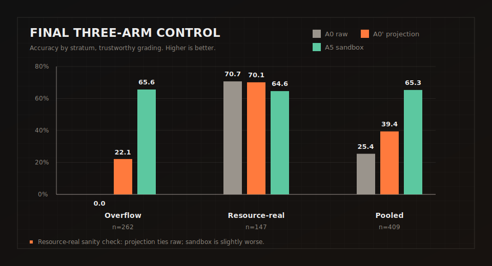
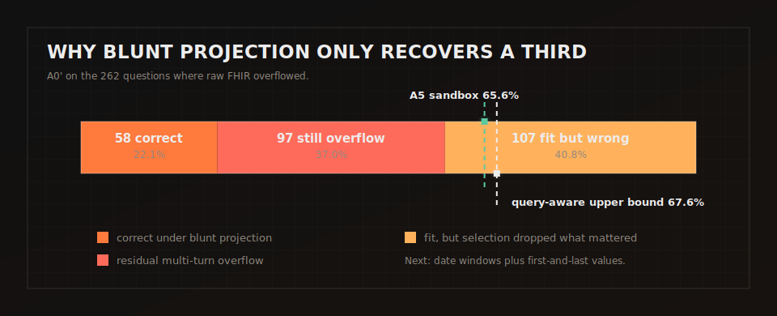

# Evaluating MCP tool surfaces for agents — an experimental FHIR / Medplum eval

> ⚗️ **Experimental / exploratory work.** This is a fork of
> [glee4810/FHIR-AgentBench](https://github.com/glee4810/FHIR-AgentBench) carrying a rig for a simple but
> slippery question: **when you expose tools to an LLM agent through an
> [MCP](https://modelcontextprotocol.io) server, do those tools actually make the agent better — and how
> would you *honestly* measure that?** The worked example is FHIR / [Medplum](https://www.medplum.com).
> The harness pattern generalizes to other MCP tool surfaces; the empirical lessons are scoped to this FHIR
> case study. Treat the numbers as preliminary; see
> [Reproducibility status](#where-this-was-actually-run--reproducibility-status).

## TL;DR

**What actually makes an LLM agent more accurate on FHIR clinical QA?** We swept the levers an engineer
would reach for, each a **paired** comparison with exact stats. **Every "win" decomposed to one thing: the
context budget.** Tool catalog, payload coaching, and thinking time are nulls; the code interpreter's
apparent win is a context-overflow artifact (a null at matched budget), not a reasoning gain.

- **Bigger / purpose-built tool catalog → NULL.** No detectable advantage over one generic `fhir-request`
  on either **Opus 4.8** or **GPT-5.5** (Opus structure-lift p=0.69; GPT-5.5 curve flat, 1 tool never
  beaten). The early **+11pp** (≈39%→50%) was a **context-budget confound**, not a tool win — and it
  replicates the parent paper's own ablation.
- **Payload shaping → cost-only** (Δ0.00). **Reasoning effort medium→high → NULL** (0/30 answer flips).
- **Code interpreter → overflow-avoidance, not a reasoning win.** Under **trustworthy grading**
  (deterministic numeric + a 3-Claude-judge panel, cross-checked by an independent codex/GPT panel and
  validated against non-LLM ground truth), the code arm shows **no significant benefit where the no-code
  agent can answer** — matched budget (both arms produced a real answer): **71.4% vs 67.9%, −3.6pp, 95% CI
  −7.7…+0.6, McNemar p=0.18 → not significant** (slight negative point estimate). Its large pooled lift
  (**+39.9pp**) is **entirely** the 262/409 (64%) questions where the no-code agent **overflows the 32k cap**
  and the code agent sidesteps it via a sandbox. **The bottleneck is *getting bounded data into context* —
  not tool design, payload, thinking time, or compute.** A code path helps only because sandboxing the
  payload dodges the overflow; payload projection plausibly pulls the same lever.
- **⚠️ The benchmark's default judge is unreliable — and we quantified it.** Against **non-LLM ground truth**
  on the 97 numeric questions, gpt-5-mini is **61% accurate** (43 false-negatives, a one-directional
  precision-punishing bias), while 3-vote panels score **98–99%** (Claude 98.2%, codex/GPT 99.1%). That bias
  manufactured an earlier spurious "code HURTS −8.6pp." Always audit your LLM judge against ground truth and
  use a panel. See [TRUSTWORTHY_REGRADE.md](docs/TRUSTWORTHY_REGRADE.md).
- **Contributions:** (1) the *correct decomposition* — the code "win" is a context-overflow artifact, not a
  compute gain; the same confound faked the tool-catalog "win"; (2) a **judge-reliability finding** — the
  default judge is 61% accurate vs ground truth; a multi-vote panel (two model families, 97% mutual
  agreement) mitigates it; (3) the grading methodology that also caught a boolean Yes/No grading bug in our own
  first fix; (4) the cap-factorial + paired-stats harness that caught the confound twice.
- ⚠️ **Reproducibility is split.** Frozen labels/summaries for the trustworthy re-grade are committed, but exact
  answer-level recomputation requires raw answer dumps that are large and gitignored. The new A0′ table is
  locally recomputable when those dumps are present; [FINAL_REPORT.md](docs/FINAL_REPORT.md) records the exact scope.
  **Opus tool-ablation numbers are not** (run on torn-down EC2). See
  [Reproducibility status](#where-this-was-actually-run--reproducibility-status).
- **Start here: [FINDINGS.md](docs/FINDINGS.md)** (the capstone conclusion). Then the tool-ablation deep-dive
  **[REPORT.md](docs/REPORT.md)** and the code result **[CODE_EXPERIMENT.md](docs/CODE_EXPERIMENT.md)**.

## Final result: A0 vs A0' vs A5

The final control asks whether the code sandbox is valuable because it computes out-of-context, or because it
selects a bounded slice of the chart. The answer is narrower: **query-aware selection is the lever; the sandbox
is one implementation.** The tested projection was deliberately blunt, so it is a floor for projection quality,
not a ceiling.



| Arm | Overflow stratum (n=262) | Resource-real stratum (n=147) | Pooled (n=409) |
|---|---:|---:|---:|
| A0 — raw FHIR in context | 0.0% | 70.7% | 25.4% |
| A0' — projection only | 22.1% | 70.1% | 39.4% |
| A5 — code interpreter | 65.6% | 64.6% | 65.3% |



Read the full, red-teamed version in [FINAL_REPORT.md](docs/FINAL_REPORT.md). The clean next experiment is a
query-aware in-context projection arm: fetch the resource type and date range the question asks for, keep
first-and-last values, and deduplicate repeated requests.

### Cost and token accounting for the final 409-question run

The final three-arm control cost **$106.86 in tracked agent API spend** across **29.15M tokens**. These numbers
come from the per-question `usage` objects in the raw answer dumps
(`runs/full409/multi_turn_resource.json`, `runs/a0prime/multi_turn_projected_resource.json`,
`runs/full409/multi_turn_code_resource.json`) and use the model-pricing table available to LiteLLM at run time.
They exclude EC2/Docker/Colima infrastructure and do **not** fully include the ad hoc judge-panel/red-team spend.

| Arm | Questions | Prompt tokens | Completion tokens | Total tokens | LLM calls | Tracked cost | Cost / question |
|---|---:|---:|---:|---:|---:|---:|---:|
| A0 — raw FHIR in context | 409 | 2.64M | 0.12M | 2.76M | 632 | $11.63 | $0.028 |
| A0' — projection only | 409 | 17.43M | 0.53M | 17.96M | 1,284 | $59.92 | $0.147 |
| A5 — code interpreter | 409 | 7.75M | 0.68M | 8.43M | 1,872 | $35.31 | $0.086 |
| **Total** | **1,227 arm-questions** | **27.82M** | **1.33M** | **29.15M** | **3,788** | **$106.86** | **$0.087** |

The cost result is part of the finding: the blunt A0' projection was both less accurate than the sandbox and
more expensive, because it still let the agent accumulate repeated projected payloads across turns. The
future A6/A7 arms should report accuracy beside the same token/cost ledger, not as a separate afterthought.

## Future work / issues

The repo is ready for GitHub issues. The issue-ready backlog lives in [ROADMAP.md](docs/ROADMAP.md):

- Run the query-aware in-context projection arm.
- Publish a minimized reproducibility artifact package with checksums.
- Rerun A0, A0', and A5 on one substrate.
- Add cross-family or human adjudication for A0' non-numeric labels.
- Run a projection cap sweep.
- Add a tracked failure-decomposition script.

## What we're actually trying to do

"Add an MCP server with N purpose-built tools and the agent gets smarter" is the kind of claim that's
**easy to assert and easy to fool yourself about.** This project is an attempt to build the eval
*correctly* — to measure whether an MCP tool surface helps while controlling for the things that usually
masquerade as a tool win:

- **Context budget.** More/richer tools return bigger payloads; bigger payloads overflow the model's
  context window. A "tool win" is often just "this arm overflowed less." → we vary the context cap as an
  explicit factor (a **2×2 cap-factorial**) to separate *reasoning gain* from *cap-dodging*.
- **Prompt vs. structure.** Is the typed tool better, or did we just *tell* the agent something we never
  told the generic tool? → a **coached-generic control** (generic tool + the same coaching in its
  description only).
- **Noise.** The original +11pp headline (and the residual ~8pp tool-structure lift after controls) sits
  across only 25–30 questions/cell — inside the noise floor (our MDE at this n is **~34–46pp**, REPORT §9.2).
  → **paired McNemar + bootstrap** on per-question deltas, not eyeballed averages.
- **Hidden failures.** Overflows / rate-limits / no-answers ≠ wrong answers. → an **answerable-set
  accuracy** + a by-cause failure taxonomy.

The reusable artifact is this methodology, not any one number.

## The harness (generalizes to any MCP eval)

| File | Role |
|---|---|
| `agent/mcp_agent.py` | Agent that retrieves through an **MCP server** — the only variable across arms is the advertised tool surface. |
| `agent/ai_agent.py` | Variant that routes completions through a server-side LLM proxy (here, Medplum's in-FHIR `$ai` op) — test the lift on the platform's *own* agentic surface, not just an external client. |
| `treatment_mcp_server.py` | **Catalog-driven** FastMCP server: one server, `TOOL_SUBSET`-selectable arms. The baseline "generic" arm is a **local FastMCP re-implementation** whose *description string* is copied byte-for-byte from Medplum's shipped `fhir-request` tool, proxying the same FHIR REST surface — it is **not** the platform's production MCP tool path. (The smoke test confirms Medplum advertises a tool playing the same role — named `fhir-request` with a hyphen; our local control registers `fhir_request` with an underscore — so it's a description-matched reimplementation, not the identical tool.) Typed tools toggle in on top. |
| `run_matrix.py` | Parameterized ablation runner: per-cell tool subset, a **nested dose-response staircase** (1→2→4→… tools), the cap-factorial, and a **hard $-budget ledger** that stops cleanly instead of surprising you. |
| `score_taxonomy.py` | raw + **answerable-set** accuracy, by-cause failure taxonomy, **paired McNemar + bootstrap**. |
| `robustness_analysis.py` | Judge-free post-hoc pass (no re-run, no spend): deterministic re-score, minimum-detectable-effect (MDE) power sim, Holm-Bonferroni. |
| `eval_budget.py` | Token-cost ledger with a hard cap. |
| `medplum-eval-bundle/` | Reproducible substrate: `docker compose` (Medplum + Postgres + Redis, MCP enabled) + an open-access MIMIC-IV-on-FHIR-demo loader. |

To point it at a *different* MCP server/domain, swap the tool server + the dataset; the runner, budget
ledger, cap-factorial, and scorer are domain-agnostic.

## The case study & what we found (preliminary)

**Finding (honest, and a null):** across Claude Opus 4.8 and GPT-5.5, the tool catalog showed **no
statistically significant accuracy advantage** over the single generic tool. The early **+11pp** (generic
≈39% → 5-tool catalog ≈50%) **did not survive** the controls above — it folded in a
context-budget/overflow artifact, has no paired statistics, and does not replicate on either model. The
only robust, significant effect was the **context cap**: reference-resolution (`_include`) tools overflow
the default budget (e.g. one Opus arm overflowed 20/25 medication questions at the stock 32k cap;
p=0.0005, the one comparison that survives Holm-Bonferroni). At least here, a well-designed single tool is
plenty. Full write-up + tables + paired stats: **[REPORT.md](docs/REPORT.md)**.

> **⚠️ This is a replication, not a discovery — and we say so up front.** The parent benchmark's *own*
> paper already ran a generic-vs-specialized retrieval ablation and found specialization does **not** help:
> o4-mini single-turn, **generic FHIR Query Generator 0.25 vs specialized Retriever 0.22**, with the lift
> to the 0.50 ceiling coming from a **code interpreter**, not specialization
> ([arXiv 2509.19319](https://arxiv.org/abs/2509.19319), Table 3). Our null **corroborates their
> intra-paper result** on a different tool surface (an MCP server's single generic tool) — what we add is
> the *method* they didn't run: paired stats + a **manipulated context-cap factorial** (they held the cap
> fixed at 32k), which traces the apparent +11pp to context budget. The contribution is the harness and the
> cap finding, **not** the (already-known) "tools don't beat generic" number.
>
> **We further refine the paper's code-interpreter attribution.** Under trustworthy grading on GPT-5.5, the
> code interpreter's lift is **also** a context-budget effect: it is **not significant at matched budget**
> (−3.6pp, p=0.18) and shows up only on the 64% of questions where the no-code agent overflows. So the code
> path doesn't reason better — it avoids the overflow. See [CODE_EXPERIMENT.md](docs/CODE_EXPERIMENT.md) and
> [TRUSTWORTHY_REGRADE.md](docs/TRUSTWORTHY_REGRADE.md).

> **The "token economics, not tool count" headline is consistent with established work, not new.** The
> input-token budget dominating retrieval over large records is documented in Lost-in-the-Middle
> ([2307.03172](https://arxiv.org/abs/2307.03172)), RULER ([2404.06654](https://arxiv.org/abs/2404.06654)),
> Chroma's "context rot," and RAG-MCP (tool-selection collapses ~43%→<14% as the tool pool grows). The
> parent paper itself reports **~3M-token full FHIR records** and that "naive loading consistently failed"
> (arXiv 2509.19319). Community FHIR MCP servers are independently moving the same way — most
> ([WSO2](https://github.com/wso2/fhir-mcp-server) ~121★ Apache-2.0, [Aidbox](https://docs.aidbox.app/modules/other-modules/mcp),
> Medplum) expose a generic request tool + CRUD rather than a purpose-built typed retrieval catalog, and
> WSO2's answer to payload size is **FHIRPath response-*filtering*** (`response_filter_fhirpaths`, shipped
> mid-2025) — i.e. the field is solving the bottleneck with projection, not tool count. Our FHIR-specific
> contribution is narrower and sharper: naming `_include`/reference-**expansion** tools as a concrete
> budget-overflow anti-pattern (design for response-*filtering*/projection instead).

## Setup (Docker) — verified boot path

The whole substrate is a `docker compose` bundle in [`medplum-eval-bundle/`](medplum-eval-bundle/):
self-hosted **Medplum** (server + Postgres + Redis, MCP enabled) loaded with the open-access
**MIMIC-IV-on-FHIR demo** (100 real de-identified ICU patients, ODbL — no PhysioNet credentialing). The
boot/auth/FHIR/MCP path below was **smoke-tested on macOS + Docker Desktop 28.4.0 on 2026-06-21**
([`medplum-eval-bundle/SMOKE_TEST.md`](medplum-eval-bundle/SMOKE_TEST.md)).

**Prereqs:** Docker + Compose v2, Python 3.10+, **`wget`** (the MIMIC loader needs it — `brew install wget`
on macOS), and an `ANTHROPIC_API_KEY` and/or `OPENAI_API_KEY`. The judge is OpenAI `gpt-5-mini`, so an
OpenAI key is needed even for the opus arms. **Keys are read from environment variables only** (litellm) —
the MCP ablation path does *not* read `config.yml` (that's only for the upstream GCP agents; copy the
template with `cp config.yml.example config.yml` if you run those). `requirements.txt` includes the MCP SDK
(`mcp`); `pip install -r requirements.txt` covers the harness.

```bash
# 0. harness deps
pip install -r requirements.txt

# Steps 1–2 are SMOKE-VERIFIED on this laptop Docker path. Steps 3–4 are NOT (see "Where this was
# actually run") — the load + ablation only ever ran on EC2; run them here at your own (budget) risk.

# 1. [verified] Stand up Medplum (postgres:16 + redis:7 + medplum/medplum-server:latest, MCP enabled).
#    First boot runs DB migrations — verified healthy in ~75s on a laptop.
cd medplum-eval-bundle && docker compose up -d
for i in $(seq 1 40); do curl -s http://localhost:8103/healthcheck | grep -q '"ok":true' && break; sleep 5; done
#    -> {"ok":true,"version":"5.1.21-...","postgres":true,"redis":true}
#    If it never goes healthy (~2 min), check: docker compose logs -f medplum-server

# 2. [verified] bare-PKCE admin token + confirm the MCP server advertises the generic baseline tool
python3 scripts/get_token.py | head -c 16   # 695-char JWT for admin@example.com / medplum_admin
#    GET 401 unauth / POST tools/list 200 -> {search, fetch, fhir-request}  (fhir-request = the baseline arm)

# 3. [⚠️ NOT smoke-verified on this path] Load the MIMIC-IV-on-FHIR demo (8 gold resource types; needs
#    wget; ~1h EC2-measured, slower on a laptop — use W=4 there; idempotent — PUTs UUID ids so the
#    benchmark's true_fhir_ids match). It hard-errors (not silent) if the download yields 0 files.
bash scripts/load_mimic.sh
#    sanity: curl -s "http://localhost:8103/fhir/R4/Patient?_summary=count" -H "Authorization: Bearer $(python3 scripts/get_token.py)"  # ~100
cd ..

# 4. [⚠️ NOT smoke-verified on this path] Project cost first (a real run is a decision, not a surprise),
#    then run the full ablation matrix + score. Run from the REPO ROOT (steps 1–3 cd'd into the bundle).
export ANTHROPIC_API_KEY=...   # opus arms      export OPENAI_API_KEY=...   # gpt arms + the judge
EVAL_GPT_MODEL=gpt-5.5-2026-04-23 python run_matrix.py --pilot 3            # prints projected $, exits
EVAL_GPT_MODEL=gpt-5.5-2026-04-23 python run_matrix.py --n 25 --n-med 40 --cap 100 --out-dir runs/tier1
python score_taxonomy.py runs/tier1            # raw + answerable-set acc, by-cause taxonomy, paired McNemar
python robustness_analysis.py medplum-eval/results   # judge-free re-score + MDE + Holm (no re-run, no spend)
```

**cwd note:** `get_token.py` / `load_mimic.sh` live in `medplum-eval-bundle/scripts/` (steps 1–3 run from
inside the bundle); `run_matrix.py` / `score_taxonomy.py` / `robustness_analysis.py` run from the **repo
root** (step 4). `run_matrix.py` skips any cell whose output JSON already exists in `--out-dir`, so use a
fresh `--out-dir` to re-run from scratch.

Knobs (all env-overridable, defaults shown): `EVAL_RUN=gpt` (or `opus` — selects the GPT-5.5 staircase
[RUN-2] vs the Opus medication-slice + cap-factorial [RUN-1]; run each into a **separate** `--out-dir` and
score separately), `EVAL_OPUS_MODEL=claude-opus-4-8`, `EVAL_GPT_MODEL=gpt-5`, `EVAL_JUDGE_MODEL=gpt-5-mini`,
`EVAL_STOCK_CAP=32000` / `EVAL_RAISED_CAP=100000` (the cap-factorial), `EVAL_WORKERS=6`. `run_matrix.py`
spawns `treatment_mcp_server.py` per cell with the right `TOOL_SUBSET` (preset
`control`/`cat2`/`cat4`/`validated5`/`arm_ref`/`arm_full8`, or a comma-list) and points the agent at it via
`MEDPLUM_MCP_URL` (the local treatment server at `127.0.0.1:8765/mcp`) — **not** Medplum's own
`8103/mcp/stream` surface, which is only the smoke-test target. Don't override `MEDPLUM_MCP_URL` by hand or
you'll silently measure the wrong server. `--cap` is a **dollar budget** enforced by a shared ledger: it
stops submitting new questions the moment the cap trips, so overspend is bounded to the in-flight batch
(≤ `EVAL_WORKERS` questions) — hard *between and within* cells, not just between them. Two footguns:
(1) the judge defaults to `gpt-5-mini` — if that model id 404s for your account, `score_taxonomy` now
**fails closed** (raises if a cell's judging totally fails, and excludes judge-errored questions from the
denominator rather than scoring them 0), so set `EVAL_JUDGE_MODEL` if needed; (2) the cost projector has
no built-in rate for `gpt-5.5`, so it
falls back to `gpt-5`'s rate — set `EVAL_RATES` for a precise projection.

## Where this was actually run — reproducibility status

**The eval results in [REPORT.md](docs/REPORT.md) were produced on AWS EC2, not on this laptop Docker path, and
most of them are not recomputable from committed artifacts.** The full pipeline (the ~1h MIMIC load + the
multi-hour Opus and GPT-5.5 ablation runs) ran on ephemeral EC2 boxes (`t3.xlarge`, us-east-2) that have
since been torn down. Be precise about what survives:

**Reproducible or preserved from this repo:**
- The Docker **boot path** (steps 1–2): containers up, Medplum healthy, bare-PKCE token, FHIR read/write
  round-trip, MCP advertises the generic `fhir-request` tool — smoke-verified on macOS
  ([`medplum-eval-bundle/SMOKE_TEST.md`](medplum-eval-bundle/SMOKE_TEST.md)).
- The **GPT-5.5 summaries and frozen labels**: deterministic re-score outputs, overflow taxonomy, LLM-judge
  accuracies, paired stats, and panel labels are committed as derived artifacts. Exact answer-level
  recomputation still needs the raw answer dumps when a script reads them directly.

**NOT reproducible (lost with a torn-down box):**
- **The entire Opus run** (including the cap-factorial and the headline "only robust effect,"
  cap-on-`arm_ref` p_holm=0.005). The raw per-question data was never pulled off the box before teardown —
  there is **no committed Opus data at all** — so the Opus numbers are reconstructed from console output.

So treat the bundle as a faithful, boot-smoke-verified **recipe** of the EC2 environment. The load-bearing,
verifiable claims are the **null** and the **GPT-5.5 curve** as frozen derived artifacts; exact answer-level
recomputation needs the raw dumps. The **Opus cap finding** remains credible-but-unverifiable. Re-running the
Opus arm on Docker (the scorer now persists per-question labels, so it can't be lost the same way) is still an
open reproducibility item.
(`robustness_analysis.py` prints a provenance banner separating computed-from-committed-data vs reconstructed.)

## Caveats — this is experimental

- **Badly underpowered** (n=25–30/cell): the minimum detectable effect at this n is **~34–46pp** (REPORT
  §9.2), so a commercially-decisive 5–10pp lift is structurally invisible. The honest null is "no tool
  effect larger than ~the MDE," not "definitively none."
- **Uncalibrated judge**: gpt-5-mini LLM-as-judge, no human gold set, κ unmeasured. Mitigated — not
  replaced — by a judge-free deterministic re-score that reproduces the same flat curve (REPORT §9.1).
- **Family-wise correction matters**: after Holm-Bonferroni over all 10 comparisons, **only the
  context-cap overflow effect survives** (p_holm=0.005); every tool-count/tool-design comparison is null
  (REPORT §9.3). No pre-registration; single seed/cell.
- **Incomplete in places**: the 8-tool GPT endpoint never ran (API quota exhausted mid-experiment), so the
  strong "too many tools *hurt*" hypothesis is untested; the 1→6 curve is flat.
- **Narrow scope**: one benchmark, single-patient retrieval only (MIMIC-IV-on-FHIR demo, 100 patients).
  Says nothing about multi-patient cohort/aggregate queries.
- **Control is a faithful re-implementation**, not Medplum's production MCP tool path (description copied
  byte-for-byte; see the harness table).
- **Replication, not discovery**: the generic-vs-typed null was already reported by the parent paper
  (0.25 vs 0.22); "token economics dominate" is established context-bottleneck literature. The novelty is
  the method bundle + the manipulated-cap finding, not the headline number.
- **Single-attempt accuracy** (no τ-bench `pass^k` reliability), and the **1→8 staircase isn't
  chance-corrected** (a random baseline grows with tool count) — read the curve as directional only.

Full limitations + reproducibility status: [REPORT.md](docs/REPORT.md) §1 and §8–§9.

## Repo layout (this fork's additions)

```
treatment_mcp_server.py      # catalog-driven FastMCP server (the arms)
run_matrix.py                # ablation runner: staircase + cap-factorial + $-budget ledger
score_taxonomy.py            # answerable-set accuracy + by-cause taxonomy + paired McNemar/bootstrap
robustness_analysis.py       # judge-free re-score + MDE power sim + Holm-Bonferroni
eval_budget.py               # token-cost ledger with a hard cap
config.yml.example           # template for the upstream GCP agents (cp -> config.yml; gitignored)
agent/mcp_agent.py           # agent that retrieves via an MCP server
agent/ai_agent.py            # agent that routes via Medplum's in-FHIR $ai op
docs/                        # findings, reports, and figures
  ├── FINDINGS.md            # start here: the capstone conclusion
  ├── REPORT.md              # full honest synthesis (numbers, stats, limitations)
  ├── CODE_EXPERIMENT.md     # the code-interpreter result
  ├── FINAL_REPORT.md        # red-teamed A0 / A0' / A5 three-arm control
  ├── TRUSTWORTHY_REGRADE.md # judge-reliability finding + trustworthy re-grade
  ├── RELATED_WORK.md, ROADMAP.md
  └── images/                # SVG figures
scripts/                     # data setup + run + judge-panel shell scripts
  ├── setup_data.sh          # downloads MIMIC-IV demo + EHRSQL (upstream)
  ├── run_full.sh, run_pilot.sh, run_409.sh   # ablation run drivers
  └── codex_panel*.sh, progress409.sh, ...    # judge-panel + progress helpers
medplum-eval-bundle/         # docker compose substrate + MIMIC loader + smoke test
  ├── docker-compose.yml
  ├── scripts/{get_token,bulk_load,load_mimic}
  ├── README.md              # Docker runbook
  └── SMOKE_TEST.md          # verified boot path
medplum-eval/                # design docs, results data, robustness output
  ├── results/               # committed GPT-5.5 per-question answers + judge labels (*.judged.json) + _scores.csv/_paired.json
  └── ROBUSTNESS_ANALYSIS.txt
```

The original benchmark's code (dataset construction, the upstream agent implementations, `evaluation_metrics.py`,
`fhir_client.py`, etc.) is unchanged from upstream and documented in their materials.

## Attribution & citation

This repository is a **fork of [glee4810/FHIR-AgentBench](https://github.com/glee4810/FHIR-AgentBench)**
(licensed **CC BY 4.0** — see [`LICENSE`](LICENSE)). The benchmark, dataset, and upstream agent
implementations are the work of the original authors — a joint research effort between **Verily Life
Sciences, KAIST, and MIT**. Everything in [Repo layout](#repo-layout-this-forks-additions) above is this
fork's addition on top of their work.

If you use FHIR-AgentBench, cite the paper:

> Gyubok Lee, Elea Bach, Eric Yang, Tom Pollard, Alistair Johnson, Edward Choi, Yugang Jia, Jong Ha Lee.
> **"FHIR-AgentBench: Benchmarking LLM Agents for Realistic Interoperable EHR Question Answering."**
> ML4H 2025. arXiv:[2509.19319](https://arxiv.org/abs/2509.19319).

```bibtex
@inproceedings{lee2025fhiragentbench,
  title     = {FHIR-AgentBench: Benchmarking LLM Agents for Realistic Interoperable EHR Question Answering},
  author    = {Lee, Gyubok and Bach, Elea and Yang, Eric and Pollard, Tom and
               Johnson, Alistair and Choi, Edward and Jia, Yugang and Lee, Jong Ha},
  booktitle = {Proceedings of Machine Learning for Health (ML4H)},
  year      = {2025},
  eprint    = {2509.19319},
  archivePrefix = {arXiv},
  url       = {https://arxiv.org/abs/2509.19319}
}
```
